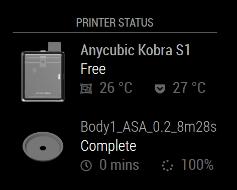

# MMM-Anycubic

This is a module for the [MagicMirror²](https://github.com/MichMich/MagicMirror/) to display the status of an Anycubic 3D printer through their undocumented, closed cloud service.

## Features

This module displays the status and temperatures of the logged-in user's first printer, and the last (or current) print jobs status, progress and remaining time.

> **IMPORTANT!** The REST API of Anycubic Cloud is not documented and not opened to 3rd-party applications. This module mimics some functionality of the webpage and the client applications, but it can break any time.



## Using the module

To use this module follow these steps:

1. Clone this repository to the `modules` folder of your MagicMirror:

```bash
git clone https://github.com/balassy/MMM-Anycubic.git
```

2. Step into the newly created folder:

```bash
cd MMM-Anycubic
```

3. Install third-party dependencies:

```bash
npm install
```

4. Add the following configuration block to the modules array in the `config/config.js` file:

```js
var config = {
  modules: [
    {
      module: 'MMM-Anycubic',
      position: 'top_left',
      config: {
        authToken: 'TODO_ADD_YOUR_AUTHENTICATION_TOKEN',
        updateInterval: 5000
      }
    }
  ]
}
```

5. If you receive `Cannot find module 'request'` error after starting MagicMirror install this package manually:

```bash
npm install request
```

This is required because newer versions of MagicMirror do not include this module that MMM-Anycubic depends on out of the box.

## Configuration options

| Option                       | Description
|------------------------------|-----------
| `authToken`                     | **REQUIRED** The authentication token of the logged-in user. Read more in the next section. <br><br> **Type:** `string` <br>**Default value:** `TODO_TOKEN`
| `updateInterval`             | *Optional* The frequency of when the module should query the status from the Anycubic Cloud service. <br><br>**Type:** `int` (milliseconds) <br>**Default value:** `15000` milliseconds (15 seconds)

## How to obtain the `authToken`

This module does not log in with username and password to the Cloud API, but instead it uses the authentication token that another Anycubic application stored.

### Getting the authentication token from the web application

1. Log in to https://cloud-universe.anycubic.com/
2. Open the browser's developer tools (F12).
3. Find the authentication token in local storage in the `XX-Token` key.

### Getting the authentication token from Anycubic Slicer Next

1. Start Anycubic Slicer Next and sign in.
2. Open the `AnycubicSlicerNext.conf` file in the current user's `%AppData%\Roaming\AnycubicSlicerNext` folder.
3. Find the authentication token in the `anycubic_cloud.access_token` key.

## Contribution

If you would like to contribute to the codebase, please use the preconfigured linters to analyze the source code before sending a pull request. To run the linters follow these steps:

1. Install developer dependencies:

```bash
npm ci
```

2. Run all linters:

```bash
npm run lint
```

## Acknowledgements

I used [WaresWichall's Anycubic Cloud Home Assistant Integration project](https://github.com/WaresWichall/hass-anycubic_cloud) to understand the undocumented Anycubic Cloud API.

These files provided the most useful information:
- [API endpoints](https://github.com/WaresWichall/hass-anycubic_cloud/blob/master/custom_components/anycubic_cloud/anycubic_cloud_api/const/api_endpoints.py)
- [Funtions](https://github.com/WaresWichall/hass-anycubic_cloud/blob/master/custom_components/anycubic_cloud/anycubic_cloud_api/api/functions.py)
- [Constants, IDs, secrets](https://github.com/WaresWichall/hass-anycubic_cloud/blob/master/custom_components/anycubic_cloud/anycubic_cloud_api/const/const.py)
- [Enums](https://github.com/WaresWichall/hass-anycubic_cloud/blob/master/custom_components/anycubic_cloud/anycubic_cloud_api/const/enums.py)
- [Authentication headers](https://github.com/WaresWichall/hass-anycubic_cloud/blob/master/custom_components/anycubic_cloud/anycubic_cloud_api/models/auth.py#L257)

Thank you [WaresWichall](https://github.com/WaresWichall) for creating that project with open source! 

## Got feedback?

Your feedback is more than welcome, please send your suggestions, feature requests or bug reports as [Github issues](https://github.com/balassy/MMM-Anycubic/issues).

## About the author

This project is created and maintaned by [György Balássy](https://www.linkedin.com/in/balassy).